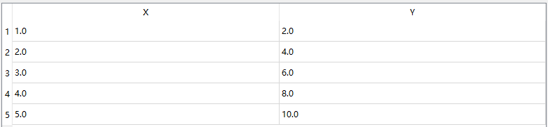

# 数据拟合大师

## 一、软件基本功能

本数据拟合应用程序名为“数据拟合大师”，旨在为用户提供一个直观且功能丰富的工具，用于执行数据拟合任务。软件的核心功能包括数据输入、拟合函数选择和图表展示。此外，为了提升用户体验和实用性，软件还支持从CSV或TXT文件中导入数据，并提供一键清除所有数据的功能。

> 上面都是屁话，下面也都是屁话。这个README是为了交大作业报告写的，东西做得很简单，话不能简单。

以下是各项功能的详细介绍：

### 1.1数据输入

数据输入是数据拟合大师的基础功能之一，允许用户通过多种方式输入数据点以进行后续的拟合分析。用户可以选择手动输入、文件输入两种方式输入数据。数据的修改和清除在本软件也有考虑并实现。

#### 1.1.1手动输入

用户可以通过界面上的输入框手动输入自变量（X）和因变量（Y）的数据点。为了方便用户，输入框提供了提示信息，例如在X输入框中显示“请输入自变量数据，以逗号或空格分隔”，在Y输入框中显示“请输入因变量数据，以逗号或空格分隔”。用户可以多次输入几组数据点然后添加到数据列表中，也可以一次输入多个数据点，系统将自动解析并添加到数据列表中。

#### 1.1.2.文件输入

为了便于批量数据处理，数据拟合大师支持从CSV文件或TXT文件中导入数据。用户可以通过点击“选择文件”按钮，从本地文件系统中选择包含数据的文件。系统会自动解析文件内容并将数据点导入到应用程序中。CSV文件和TXT文件均需满足一定的格式要求，即文件中每行应包含一个数据点，X和Y值之间以逗号或其他分隔符分隔。

#### 1.1.3一键清除

为了方便用户进行数据管理，数据拟合大师提供了一键清除功能。用户只需点击“一键清除”按钮，即可清除当前所有已输入的数据点以及数据列表和拟合图像面板。这一功能对于需要频繁调整和重新输入数据的用户尤其有用。

#### 1.1.4数据更改

数据更改功能是数据拟合大师的一项重要增强，允许用户在添加数据到数据列表后，对表格中的单个数据点进行直接修改，而无需清除所有数据重新输入。这一功能的具体实现为用户可以直接在数据表格中选中任意数据点并进行编辑。双击表格单元格即可进入编辑模式，修改数据后按回车键确认更改。此功能使用户可以方便地纠正输入错误或调整数据，而不必重新输入所有数据点，极大地提高了操作的灵活性和效率。

### 1.2拟合函数选择

数据拟合大师提供了多种拟合函数选项，以满足不同的应用需求。用户可以通过下拉菜单选择适合其数据特性的拟合函数类型。支持的拟合函数包括多项式函数、指数函数、对数函数和正弦函数。

#### 1.2.1多项式函数（Polynomial）

用户可以指定多项式的次数（degree），应用程序将使用最小二乘法原理进行多项式拟合，使用最小二乘法可以将所求系数转换为一个线性方程组，对于线性方程组的求解本软件使用高斯列主元消去法求解多项式的待定系数，计算出拟合曲线的系数便可生成拟合曲线。

#### 1.2.2多项式拟合次数选择

若用户选择了多项式拟合，则还需输入多项式拟合的最高次数。该最高次数输入框会随着用户选择拟合函数类型实时更新，若选择了非多项式拟合，则该数据框会被隐藏；反之显示在界面上。

#### 1.2.3指数函数（Exponential）

适用于指数增长或衰减的数据。应用程序将使用指数函数形式进行拟合。

#### 1.2.4对数函数（Logarithmic）

适用于对数增长的数据。应用程序将使用对数函数形式进行拟合。

#### 1.2.5正弦函数（Sine）

适用于周期性波动的数据。应用程序将使用正弦函数形式进行拟合。

### 1.3图表展示

为了直观展示数据及其拟合结果，数据拟合大师集成了图表绘制功能。具体功能包括数据点展示、拟合曲线展示、图表交互功能以及数据点实时更新功能。

#### 1.3.1数据点展示

为了使数据输入过程更加直观和动态，数据拟合大师在添加数据到数据列表后，会自动绘制数据的散点图到绘图面板。每当用户通过手动输入或文件导入添加新的数据点到数据列表后，软件会自动在绘图面板上绘制这些数据点的散点图。数据点以红色标记，直观地显示在坐标系中。此功能帮助用户实时观察数据的分布情况，便于进一步的分析和处理。

#### 1.3.2拟合曲线展示

根据用户选择的拟合函数类型，当单机面板上的“数据拟合”按钮后，应用程序会在图表中绘制相应的拟合曲线，并使用不同的颜色加以区分。每次选择不同拟合函数所拟合出来的曲线会根据数据点的分布自动调整图形面板的坐标刻度，以便用户观察曲线拟合效果。

#### 1.3.3实时更新散点图

数据修改的实时更新功能确保了用户在数据表格中修改任意数据点后，散点图能够即时反映这些更改，从而保持数据和图表的一致性。具体实现为当用户在数据表格中修改某个数据点后，软件会自动更新绘图面板上的散点图，实时反映最新的数据变化。此功能使用户无需手动刷新图表，极大地提升了数据修改的便捷性和使用体验。

通过这些基本功能，数据拟合大师为用户提供了一个实用且简洁的数据拟合工具，能够满足多种数据分析和处理需求。

## 二、总体设计思想

数据拟合大师的总体设计思想是创建一个用户友好的、功能丰富的数据拟合应用程序，旨在简化数据处理和分析过程。通过提供多种数据输入方式、灵活的拟合函数选择和实时图表展示，数据拟合大师帮助用户高效简洁地进行数据拟合和分析。

### 2.1总体思想文字描述

数据拟合大师的设计思想主要包括模块化设计、用户友好界面、实时交互、多种拟合函数支持和高校数据处理几个方面。

#### 2.1.1模块化设计

采用模块化设计思想，将应用程序划分为多个功能模块，包括数据输入模块、数据处理模块、拟合函数选择模块和图表展示模块。每个模块独立工作，且相互协作，确保系统的可扩展性和可维护性。

#### 2.1.2用户友好界面

提供直观且易于操作的用户界面，使用户可以方便地输入数据、选择拟合函数并查看拟合结果。通过提供输入提示、文件导入功能和一键清除功能，提升用户体验。

#### 2.1.3实时交互

实现数据的实时处理和展示。每当用户添加或修改数据时，系统会自动更新数据列表和图表展示，确保用户可以即时看到数据变化和拟合效果。

#### 2.1.4多种拟合函数支持

支持多种拟合函数，包括多项式、指数函数、对数函数和正弦函数，以满足不同数据特性的分析需求。特别是多项式拟合中，采用高斯消去法求解系数，确保计算的准确性和效率。

#### 2.1.5高效数据处理

对于多项式拟合则采用最小二乘法原理进行拟合，在求解线性方程组时使用高斯列主元消去法求解。最小二乘法原理是要求误差平方和最小，最小二乘法解决产生的最优化问题仅需使用几个变量的计算，规律性强，容易计算机实现和普及。而对于其他拟合函数则利用NumPy和SciPy等科学计算库，实现高效的数据处理和拟合计算，确保应用程序在处理大规模数据时的性能。

### 2.2系统框图

本软件的系统框图如下图1：


图1 系统框图

系统框图展示了数据拟合大师的主要模块及其功能。整个系统分为数据输入模块、拟合函数选择模块、数据处理模块和图表展示模块。每个模块都有其独特的功能，协同工作以实现应用程序的总体功能。数据输入模块支持手动输入、文件导入、数据更改和一键清除功能。拟合函数选择模块提供多种拟合函数选择。数据处理模块负责数据存储、验证和更新。图表展示模块则负责显示数据点和拟合曲线，并实现实时更新。

### 2.3系统流程图

本软件的系统流程图如下图2所示。


图2 系统流程图

流程图描述了数据拟合大师的操作流程。应用程序启动后，显示主界面，用户可以通过手动输入或文件导入方式输入数据。数据输入后，系统会存储并展示数据点。若用户修改了某个数据则重新进行数据存储和展示。在用户选择拟合函数后，系统计算拟合结果并显示拟合曲线。用户可以选择修改数据，系统会实时更新数据点和散点图，最终用户可以选择结束应用程序。

### 2.4系统UML类图

本软件的系统UML类图如下图3所示。该图仅展示了该类的函数，还有其他代码文件并未在此处展示。


图3 系统UML类图

UML类图描述了数据拟合大师的核心类及其主要方法。```DataFittingApp```类是应用程序的核心类，包含数据列表、图表对象及其绘制方法。主要方法包括创建输入表单、创建数据表格、创建绘图面板、添加数据点、从文件导入数据、清除数据、拟合数据、多项式拟合、高斯消去法、指数函数拟合、对数函数拟合、正弦函数拟合以及绘制数据方法。每个方法对应具体的功能，确保应用程序的高效运行和灵活操作。

除此之外，本软件系统还有两个关键文件：```tools.py```文件所示的函数如图4所示，主要包含一些工具类函数；```fit_funcs.py```文件所示的函数如图5所示，主要包括拟合函数。


图4 ```tools.py```文件函数结构


图5 ```fit_funcs.py```文件函数结构

图3至图5展示了本软件系统的函数结构，每个结构的发挥着重要作用。

> 通过上述设计，数据模拟大师实现了模块化、用户友好和实时交互等设计目标，提供了实用且简洁的数据拟合和分析功能。

## 三、编程实现

在数据拟合大师应用程序中，核心算法主要包括：1.多项式拟合时通过最小二乘法求得线性方程组；2.使用高斯消去法求解所得线性方程组。多项式拟合是通过最小二乘法原理找到一个多项式，使其尽可能贴合输入的数据点。为了求解多项式的系数，本软件系统使用高斯消去法进行求解。以下是这两个核心算法的详细实现思路。

### 3.1基于最小二乘法原理求线性方程组

对于给定数据点$`\left( {{x_i},{y_i}} \right)`$和多项式次数$`n`$，需要求解多项式的系数$`{a_n},{a_{n - 1}}, \ldots ,{a_0}`$，使得多项式(1)的误差平方和最小。

$$
\begin{array}{*{20}{c}}
{P\left( x \right) = {a_n}{x^n} + {a_{n - 1}}{x^{n - 1}} +  \ldots  + {a_1}{x^1} + {a_0}{x^0} \;}\tag{1}
\end{array}
$$

将多项式(1)与每个$`{y_i}`$求误差，得平方和式(2)。

$$
\begin{array}{*{20}{c}}
{J = \mathop \sum \limits_{i = 1}^k {{\left( {P\left( {{x_i}} \right) - {y_i}} \right)}^2}}\tag{2}
\end{array}
$$

其中$`k`$是数据点的个数。函数拟合的目标是使式(2)最小，而式(2)是关于系数$`{a_n},{a_{n - 1}}, \ldots ,{a_0}`$的多元函数。于是问题转换成多元函数求极值问题，根据多元函数求极值的基本条件“偏导为零”，有

$$
\left\{\begin{array}{c}
a_{n} \sum_{i=1}^{k} x_{i}^{n}+a_{n-1} \sum_{i=1}^{k} x_{i}^{n-1}+\cdots+a_{0} \sum_{i=1}^{k} x_{i}^{0}=\sum_{i=1}^{k} x_{i}^{0} y_{i} \\
a_{n} \sum_{i=1}^{k} x_{i}^{n+1}+a_{n-1} \sum_{i=1}^{k} x_{i}^{n}+\cdots+a_{0} \sum_{i=1}^{k} x_{i}^{1}=\sum_{i=1}^{k} x_{i}^{1} y_{i} \\
\vdots \\
a_{n} \sum_{i=1}^{k} x_{i}^{n+n}+a_{n-1} \sum_{i=1}^{k} x_{i}^{n+n-1}+\cdots+a_{0} \sum_{i=1}^{k} x_{i}^{n}=\sum_{i=1}^{k} x_{i}^{n} y_{i}\tag{3}
\end{array}\right.
$$

即

$$
\begin{array}{*{20}{c}}
{Ax = b}\tag{4}
\end{array}
$$

其中$`A`$是一个$`n + 1 \times n + 1`$的矩阵，由已知数据点可以求得；$`b`$是一个长度为$`n+1`$的向量，由已知数据点可以求得；$`x`$是线性方程组所求的未知量，即多项式的系数。该部分的关键实现代码如下：

```python
def polynomialFit(x, y, degree):
n = degree + 1 # 多项式系数个数：有多少个系数就有多少个方程
A = [[0 for _in range(n)] for_ in range(n)] # 创建系数矩阵，初始化为0
# 遍历矩阵赋值 ---> 确定A矩阵
for i in range(len(A)):
# 确定该行最大次数
max_times = degree + i
for j in range(len(A[i])):
# 确定该元素次数
cur_times = max_times - j
# 矩阵元素赋值
A[i][j] = sum([xk ** cur_times for xk in x])
# 确定b矩阵
b = [0 for _ in range(n)]
for i in range(len(b)):
b[i] = sum([y[idx] * (xk ** i) for idx, xk in enumerate(x)])
```

### 3.2使用高斯列主元消去法解线性方程组

```gaussianElimination``` 函数实现了标准的高斯消元法，通过列主元消去提高了数值稳定性，最终通过回代过程得到线性方程组的解。列主元消去的主要步骤是，在每一列选择绝对值最大的元素作为主元，并将其所在行交换到当前行，这样可以减小数值误差的影响。接下来本文对该关键算法通过代码结合进行详细讲解。

#### 3.2.1函数声明和初始化

```python
def gaussianElimination(A, b):
n = len(b)
M = copy.deepcopy(A)
```

- ```gaussianElimination``` 函数接收两个参数：系数矩阵```A```和常数向量```b```。
- ```n```是方程组的规模（即变量的个数）。
- ```M```是```A```的深拷贝，防止修改原矩阵```A```。

#### 3.2.2主元选择和行交换

```python
for i in range(n):
maxEl = abs(M[i][i])
maxRow = i
for k in range(i + 1, n):
# 在每一列，从当前行开始，寻找绝对值最大的元素所在的行（主元）
if abs(M[k][i]) > maxEl:
maxEl = abs(M[k][i])
maxRow = k
# 将找到的主元所在行与当前行交换，以确保主元位于对角线上
for k in range(i, n):
M[maxRow][k], M[i][k] = M[i][k], M[maxRow][k]
# 对应地，交换常数向量𝑏中的元素
b[maxRow], b[i] = b[i], b[maxRow]
```

- 外层循环遍历每一列， ```i```是当前处理的列号。
- ```maxEl``` 保存当前列中最大元素的绝对值，```maxRow``` 记录最大元素所在的行号。
- 内层循环从当前行```i```开始向下寻找当前列中绝对值最大的元素，并记录其行号 ```maxRow```。
- 将当前行```i```与 ```maxRow ```行交换，使得最大元素移动到对角线位置。
- 同时交换常数向量```b```中对应的元素，保持方程的一致性。

#### 3.2.3消元过程

```python
# 对于当前行以下的所有行，通过消去当前列的元素，形成上三角矩阵
for k in range(i + 1, n):
	c = -M[k][i] / M[i][i] # 用于消去元素的乘数
	# 把i行乘以系数c后加到第k行上
	for j in range(i, n):
		if i == j:
		M[k][j] = 0
	else:
		M[k][j] += c * M[i][j]
	b[k] += c * b[i]
```

- 外层循环遍历当前行以下的所有行```k```，进行消元操作。
- 计算系数```c```，用于将```k```行的第```i```列元素消为零。
- 内层循环遍历当前行```i```的所有列```j```，更新```k```行的元素。
  - 如果是对角线元素，直接置零。
  - 否则，将```i```行的元素乘以系数```c```后加到```k```行对应元素上。

- 更新常数向量```b```中的元素，保持方程的一致性。

#### 3.2.4回代过程

```python
# 回代过程
x = [0 for _ in range(n)] # 初始解
# 从最后一行开始，逐行向上计算每个变量的值
for i in range(n - 1, -1, -1):
x[i] = b[i] / M[i][i]
for k in range(i - 1, -1, -1):
b[k] -= M[k][i] * x[i]
```

- ```x```初始化为零向量，用于存放解。
- 外层循环从最后一行开始向上回代，计算每个变量的值。
- ```x[i]```通过将```b[i]```除以```M[i][i]```得到。
- 内层循环更新```b```向量，将已知解的影响减去，为后续的回代过程做好准备。
- 最终返回解向量```x```。

## 四、软件测试

为了确保数据拟合应用程序的稳定性、鲁棒性、准确性和用户友好性，必须进行全面的软件测试。测试用例涵盖了应用程序的主要功能，包括数据输入、拟合函数选择、图表展示和数据更改功能。以下是详细的测试用例及对应的运行结果分析。

### 4.1输入数据

测试目标：验证输入数据点功能是否正常工作。

#### 4.1.1输入逗号分割的数据

步骤：

1. 启动应用程序。
2. 在X输入框中输入“1, 2, 3, 4, 5”。
3. 在Y输入框中输入“2, 4, 6, 8, 10”。
4. 点击“添加数据”按钮。
5. 检查数据列表和散点图。

预期结果：

1. 数据列表显示输入的数据点。

2. 散点图上正确显示输入的数据点。

运行结果：

1. 数据列表正确显示数据点：[1.0, 2.0, 3.0, 4.0, 5.0] 和 [2.0, 4.0, 6.0, 8.0, 10.0]。



图4.1(a) 逗号分割数据正常读取

2. 散点图正确显示五个红色散点。


图4.1(b) 逗号分割数据正常显示

#### 4.1.2输入空格分割的数据

步骤：

1. 启动应用程序。

2. 在X输入框中输入“1 2 3 4 5”。

3. 在Y输入框中输入“2 4 6 8 10”。

4. 点击“添加数据”按钮。

5. 检查数据列表和散点图。

预期结果：

1. 数据列表显示输入的数据点。

2. 散点图上正确显示输入的数据点。

运行结果：

1. 数据列表正确显示数据点：[1.0, 2.0, 3.0, 4.0, 5.0] 和 [2.0, 4.0, 6.0, 8.0, 10.0]。


图4.2(a) 空格分割数据正常读取

2. 散点图正确显示五个红色散点。


图4.2(b) 空格分割数据正常显示

#### 4.1.3输入逗号和空格混合分割的数据

步骤：

1. 启动应用程序。

2. 在X输入框中输入“1, 2 3, 4, 5”。

3. 在Y输入框中输入“2, 4 ,6 ,8 10”。

4. 点击“添加数据”按钮。

5. 检查数据列表和散点图。

预期结果：

1. 数据列表显示输入的数据点。

2. 散点图上正确显示输入的数据点。

运行结果：

1. 数据列表正确显示数据点：[1.0, 2.0, 3.0, 4.0, 5.0] 和 [2.0, 4.0, 6.0, 8.0, 10.0]。


图4.3(a) 逗号空格混合分割数据正常读取

2. 散点图正确显示五个红色散点。


图4.3(b) 逗号空格混合分割数据正常显示

#### 4.1.4输入长度不一致的X和Y数据

步骤：

1. 启动应用程序。

2. 在X输入框中输入“1 2”。

3. 在Y输入框中输入“2, 4 ,6 ,8 10”。

4. 点击“添加数据”按钮。

5. 检查弹窗。

预期结果：

- 弹出错误弹窗“数据长度不匹配”，提示用户输入正确数据。

运行结果：

- 错误弹窗正确弹出。


图4.4数据长度不一致时错误弹窗正确弹出

#### 4.1.5输入含有无法转换为浮点数的数据

步骤：

1. 启动应用程序。

2. 在X输入框中输入“1& 2”。

3. 在Y输入框中输入“2，4”。

4. 点击“添加数据”按钮。

5. 检查弹窗。

预期结果：

* 弹出错误弹窗“could not convert string to float: ’XXX’”，提示用户输入正确数据。

运行结果：

- 错误弹窗正确弹出。


图4.5输入含有无法转换的数据时错误弹窗正确弹出

#### 4.1.6不输入或者只含空格的空数据

步骤：

1. 启动应用程序。

2. 在X输入框中输入“ ”。

3. 不在Y输入框中输入数据。

4. 点击“添加数据”按钮。

预期结果：

- 弹出错误弹窗“请输入拟合数据”，提示用户输入要拟合的数据点。

运行结果：

- 错误弹窗正确弹出。


图4.6输入空数据时错误弹窗正确弹出

#### 4.1.7文件导入数据

步骤：

1. 启动应用程序。

2. 点击文件导入。

3. 选择CSV或者TXT文件。

4. 点击文件选择框的“打开”按钮。

预期结果：

1. 文件中的数据可被正确填充到X和Y的输入框，且数据以逗号分割。

2. TXT文件每列数据可由逗号或者空格分割，TXT文件数据可被正确填充到输入框。

   

图4.7 TXT文件每列数据可由逗号或者空格分割

运行结果：


图4.8文件数据都能被正确填充到输入框

### 4.2数据拟合

测试目标：验证数据拟合功能是否正确工作。

#### 4.2.1拟合函数选择

步骤：

1. 启动应用程序。

2. 选择拟合函数下拉框分别选择“Polynomial”、“Exponential”、“Logarithmic”、“Sine”。

3. 观察UI界面的变化。

预期结果：

1. 若选择“Polynomial”，则下拉框下面会出现输入多项式次数输入框。

2. 若选择了除“Polynomial”的其他选项，多项式次数输入框会消失。

运行结果：

1. 选择“Polynomial”，下拉框下面出现输入多项式次数输入框。


图4.9选择“Polynomial”后，出现次数输入框

2. 选择了除“Polynomial”的其他选项，UI界面不会出现额外变化。


图4.10选择非“Polynomial”后，次数输入框消失

#### 4.2.2多项式次数输入限制

步骤：

1. 启动应用程序。

2. 在选择拟合函数下拉框选择“Polynomial”。

3. 在多项式次数输入框分别输入-1，0，1，10。

预期结果：

- 只有0和1能输入，-1和10无法输入。

运行结果：

- 多项式拟合最低次数为0，此时拟合曲线为以条平行于横轴的直线；最高次数为9。


图4.11多项式次数输入范围[0, 9]

#### 4.2.3空数据点击“数据拟合”按钮

步骤：

1. 启动应用程序。

2. 点击“数据拟合”按钮。

3. 观察UI界面的变化。

预期结果：

- 此时数据列表无数据，软件弹出“请添加拟合数据”弹窗。

运行结果：

- 数据列表无数据时，点击“数据拟合”按钮弹出弹窗。


图4.12无数据点击“数据拟合”出现错误弹窗

#### 4.2.4数据点少于待求系数

步骤：

1. 启动应用程序。

2. 在X和Y输入框分别输入“1”和“2”。

3. 点击“添加数据”按钮。

4. 在多项式次数输入框输入“1”。

5. 点击“数据拟合”按钮。

6. 观察运行结果。

预期结果：

- 软件弹出“数据点不足以支撑拟合1次多项式”弹出。

运行结果：

- 此时需要拟合的多项式为1次多项式，有2个系数；而给的数据点只有一个点，不足以拟合该1次多项式，所以系统弹出错误弹窗。


图4.12数据点个数少于待求系数出现错误弹窗

同理，对于选择指数拟合函数，则至少需要2个数据点；选择对数拟合函数，至少需要2个数据点；选择正弦拟合函数，至少需要3个数据点。

#### 4.2.5拟合曲线随拟合函数变化

步骤：

1. 启动应用程序。

2. 选择文件导入数据。

3. 点击“添加数据”按钮。

4. 选择不同拟合函数进行拟合。

5. 点击“数据拟合”按钮。

6. 观察拟合曲线显示有无异常。

预期结果：

1. 点击“数据拟合”按钮后，系统自动画出拟合曲线在面板上，图例正常显示。

2. 当改变拟合函数再次点击“数据拟合”按钮后拟合曲线会重新绘制。

3. 之前的拟合曲线会自动被清除，并且坐标轴自适应数据范围，不会出现坐标轴刻度很大或者很小的情况。

运行结果：

- 首先进行多项式拟合，拟合曲线如下图4.13：


图4.13二次多项式拟合曲线

- 然后选择指数函数进行拟合，拟合曲线如下：


图4.14指数函数拟合曲线

- 然后选择对数函数进行拟合，拟合曲线如下图4.15：


图4.15对数函数拟合曲线

- 最后选择正弦函数进行拟合，拟合曲线如下图4.16：


图4.16正弦函数拟合曲线

从图13到图16可以看出结果符合预期：图例正常显示、拟合曲线会重新绘制、坐标轴自适应数据范围。

### 4.3修改数据点

测试目标：验证修改数据点后，数据列表和散点图是否实时更新；验证是否可以随意修改数据。

#### 4.3.1实时更新数据点

步骤：

1. 启动应用程序并输入数据点：[1, 2, 3, 4, 5] 和 [2, 4, 6, 8, 10]。

2. 在数据列表中修改第一个数据点为(1, 3)。

3. 检查数据列表和散点图。

预期结果：

1. 数据列表正确显示修改后的数据点。

2. 散点图上相应的数据点实时更新。

运行结果：

- 下图4.17为未修改时的数据列表和散点图。


图4.17未修改时的数据列表和散点图

- 下图4.18为修改第一个数据点为(1,3)的数据列表和散点图。


图4.18修改数据后的数据列表和散点图

> 由图18可以看出数据列表和散点图正确显示修改后的数据点。

#### 4.3.2限制修改数据为空

步骤：

1. 启动应用程序并输入数据点：[1, 2, 3, 4, 5] 和 [2, 4, 6, 8, 10]，然后添加数据。

2. 在数据列表中删除第一个数据点的Y值，然后回车。

3. 观察软件提示。

预期结果：

1. 软件弹出“无效值”错误弹窗。

2. 数据点的值保持不变，仍是2.0。

运行结果：

- 弹窗正确弹出，数据点值未能成功修改，符合预期。


图4.19未修改时的数据列表和散点图

### 4.4一键清除数据

测试目标：验证清除数据功能是否正常工作。

步骤：

1. 启动应用程序。

2. 并输入从文件导入数据，然后添加数据。

3. 选择适合的拟合函数，点击“数据拟合”按钮进行曲线拟合。

4. 点击“一键清除”按钮。

5. 重复步骤2至步骤3多次，观察有无异常。

预期结果：

1. 每次点击“一键清除”按钮后，数据列表清空、绘图区清空。

2. 使用“一键清除”后再点击“数据拟合”会弹出“请添加拟合数据”弹窗。

运行结果：

- 下图4.20为使用“一键清除”前的UI界面。


图4.20使用“一键清除”前界面

- 下图4.21为使用“一键清除”后的UI界面。


图4.21使用“一键清除”后界面

- 下图4.22为使用“一键清除”后，再点击“数据拟合”按钮的UI界面。
- 


图4.22使用“一键清除”后，点击“数据拟合”按钮的界面

图4.21说明“一键清除”清除了UI界面的所有数据，而图4.22说明“一键清除”功能清除了內部所有数据，而不仅仅是UI显示的数据。

### 4.5测试用例总结

通过上述测试用例，数据拟合大师在主要功能方面表现出色，所有预期结果均成功实现，具体分析如下：

1. 手动输入数据点：手动输入数据点功能正常工作，数据列表和散点图均能正确显示输入的数据点，满足用户数据输入需求。

2. 从文件导入数据：文件导入功能稳定，能够正确解析CSV文件和TXT文件内容，并显示在数据列表和散点图中，提供了便捷的数据输入方式。

3. 检测输入数据合理性：软件会检测各种不合理输入，并提示用户输入正确数据。

4. 数据拟合：数据拟合功能准确，并且能检测各种不合理的数据，提高了系统的鲁棒性。每种拟合函数都能得出正确的拟合方程，并在图表中显示拟合曲线，验证了算法的正确性和稳定性。

5. 实时更新数据点：数据修改功能实现了数据列表和散点图的实时更新，用户在修改数据后能够即时看到更新效果，提升了用户体验和操作便捷性。

6. 一键清除数据：清除数据功能正常工作，能够清空数据列表和散点图，确保用户能够快速重置数据输入状态。

通过上述测试，数据拟合大师的核心功能得到了全面验证，证明了其在数据输入、拟合计算和图表展示方面的稳定性和准确性。应用程序满足了本次大作业设计要求，为用户提供了实用且简洁的数据拟合和分析工具。

## 五、结论

### 5.1大作业总结

在本课程的大作业中，我开发了一个名为“数据拟合大师”的数据拟合应用程序。通过这个软件项目，我不仅深入理解了多项式数据拟合的基本原理和算法，还将这些理论应用于实际软件开发中，实现了一个功能全面、用户友好的应用程序。以下是我对大作业的总结：

1. 软件功能实现：

数据输入：数据拟合大师支持手动输入和从CSV/TXT文件导入数据，并实现了数据修改和一键清除功能。这些功能的实现确保了数据输入的灵活性和便捷性。

拟合函数选择：应用程序支持多种拟合函数，包括多项式、指数函数、对数函数和正弦函数。特别是在多项式拟合中，使用了基于最小二乘法原理求得线性方程组，然后使用高斯消去法求解线性方程组的系数。

图表展示：实时绘制和更新散点图以及拟合曲线，使用户能够直观地观察数据和拟合结果，增强了用户体验。

2. 核心算法：

求得线性方程组：基于最小二乘法原理构建线性方程组。

求解线性方程组：使用高斯列主元消去法求解构建的线性方程组，得到多项式拟合的系数。

3. 软件测试：

通过一系列详细的测试用例，验证了数据拟合的各项功能，包括数据输入、拟合计算、图表展示以及各种非法输入。测试结果表明，应用程序稳定可靠，满足了设计要求。

### 5.2课程感悟

在“计算机数学”这门课程中，通过完成这个大作业，我有以下几点深刻的感悟：

1. 理论与实践的结合：课程中学到的数学理论和算法，通过大作业得到了实际应用。特别是多项式拟合和最小二乘法、高斯列主元消去法等内容，不再是抽象的理论，而是通过代码实现变得具体和生动。这种理论与实践的结合，让我对数学原理有了更深刻的理解。

2. 编程能力的提升：通过Python编程实现“数据拟合大师”的各项功能，我在数据处理、算法实现和界面设计等方面的编程能力得到了显著提升。同时，掌握了PyQt5的使用，以及NumPy和SciPy等科学计算库的使用，增强了我解决实际问题的能力。

3. 项目管理与问题解决：在项目开发过程中，遇到了许多挑战和问题，如算法优化、界面设计和功能调试等。通过查阅资料、与同学讨论和不断尝试，我逐步解决了这些问题。这培养了我独立思考和解决问题的能力，以及项目管理和团队协作的技能。

4. 用户体验的重要性：在设计和实现“数据拟合大师”的过程中，我深刻认识到用户体验的重要性。一个好的软件不仅要功能强大，还要易于使用、界面友好。这促使我在开发过程中不断优化用户界面和交互方式，以提升用户的操作体验。

5. 数学在计算机科学中的应用：这门课程让我认识到，数学不仅是计算机科学的重要基础，而且在数据处理、算法设计和机器学习等领域有着广泛的应用。通过这次大作业，我深刻体会到了数学在实际问题解决中的重要作用。

总的来说，通过完成数据拟合应用程序的大作业，我不仅巩固了“计算机数学”课程中学到的理论知识，还提高了编程能力和项目管理能力。这次大作业让我认识到，理论与实践的结合是掌握知识和技能的有效途径，而数学作为计算机科学的重要基础，其应用前景广阔。感谢这门课程和这次大作业，让我在学术和实践中都得到了宝贵的经验和收获。
